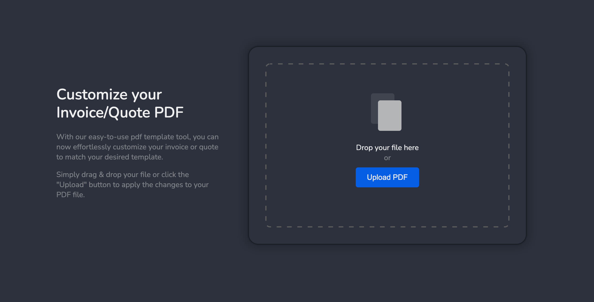
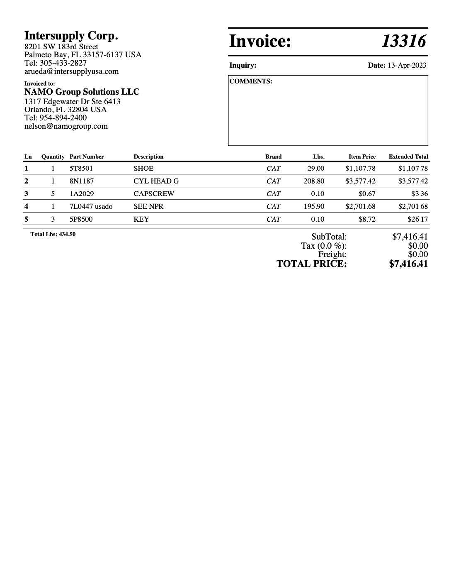
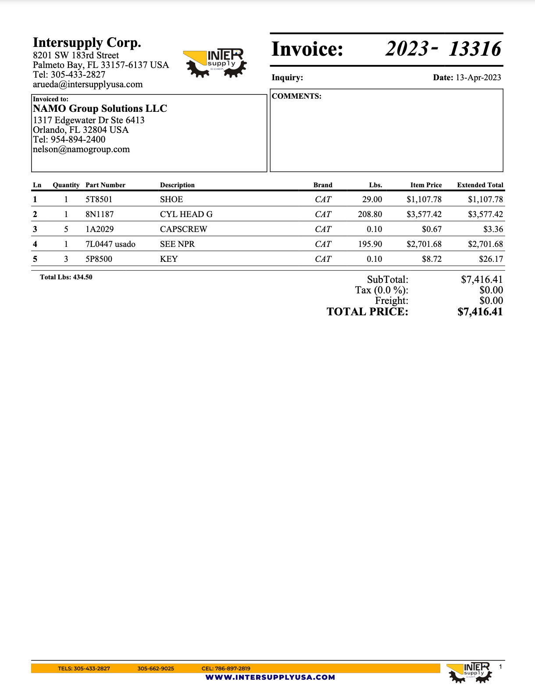

# intersupply-pdf-template

**Site:**           https://nilsonmolina.github.io/intersupply-pdf-template/  
**Custom Domain:**  https://intersupply.us.to  
**Analytics:**      https://analytics.umami.is/dashboard  

Customer requested a custom invoice template. This was a quick solution I came up with, where the user
could select their existing invoice and this would overlay their requested styles on top of the invoice.
Logo, boxes, colors, text, etc. were created in a figma design, exported as a PNG and then that image
is overlayed on the PDF. I also programatically add page numbers to the bottom of each pdf page.

I'm quite impressed with how this came out. Super easy solution and no need for a server. The entire
tool runs in the browser, so user's do not actually need to upload or even pay a hosting fee, it is
completely run on github pages. I then created a free subdomain (intersupply.us.to) and forward any
traffic to this free and SSL secured Github Pages instance. I also added analytics using Umami and am
tracking button click vs drag/drop. Mainly wanted to see if the client was even using this as they said
this was "imperative" to their business, but they did not want to pay me at all -.-

*NOTE: I should probably clean up the code, but needed a quick turnaround for this one.

**Site**  

**Original Invoice**  

**Customized Invoice** - _as per clients request_  

